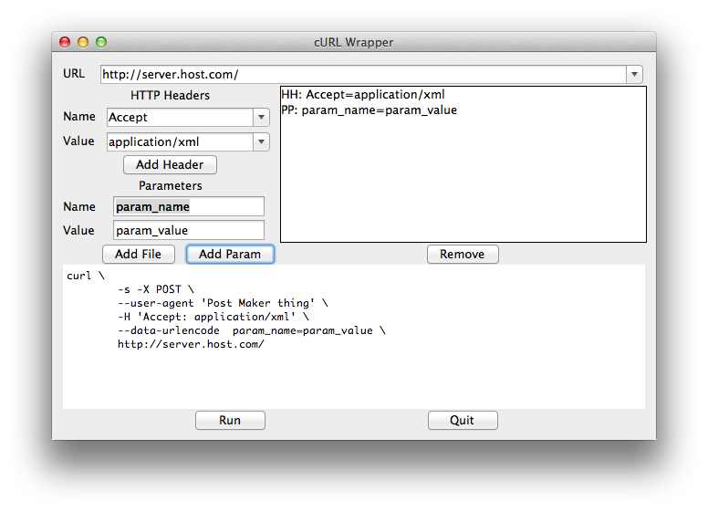

# cURL Wrapper #

## reason ##
for some reason people I work with don't know how to use curl on the command line, so I through this project together. Assumes you have a modern version of curl which supports `--data-urlencode`

## Usage ##
    >git clone https://github.com/jceaser/curl_wrapper.git
    >python curl.py
    
Any combo box values added in the script are stored in the local directory as files:

* ./url.values
* ./head.names
* ./head.values

## License ##
I (thomas cherry) wrote most of this in an afternoon. It would not have been possible without the help of others (as found by google). I place the code in the public domain since it's all from the public anyways. If you find this helpful and are so inclined, you can give me credit or simply link back to this project.